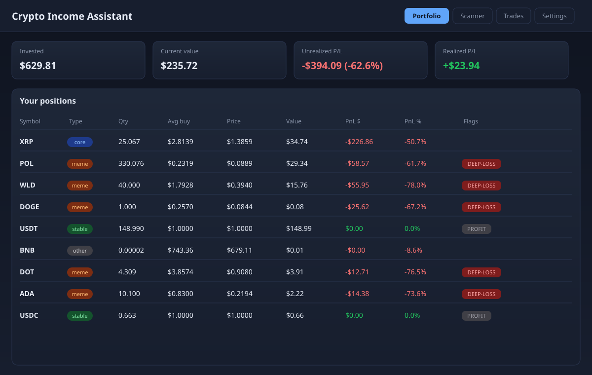
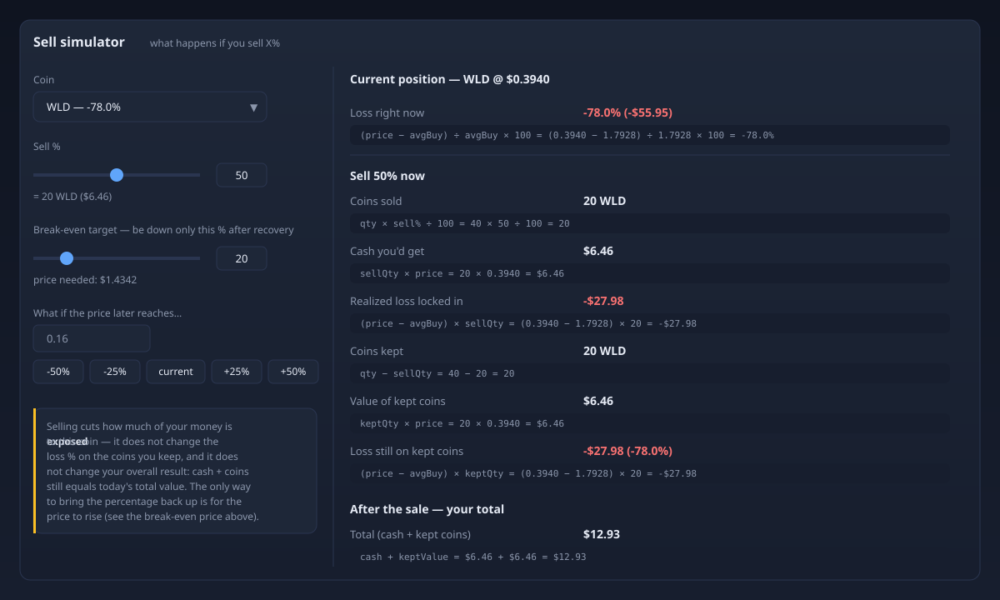
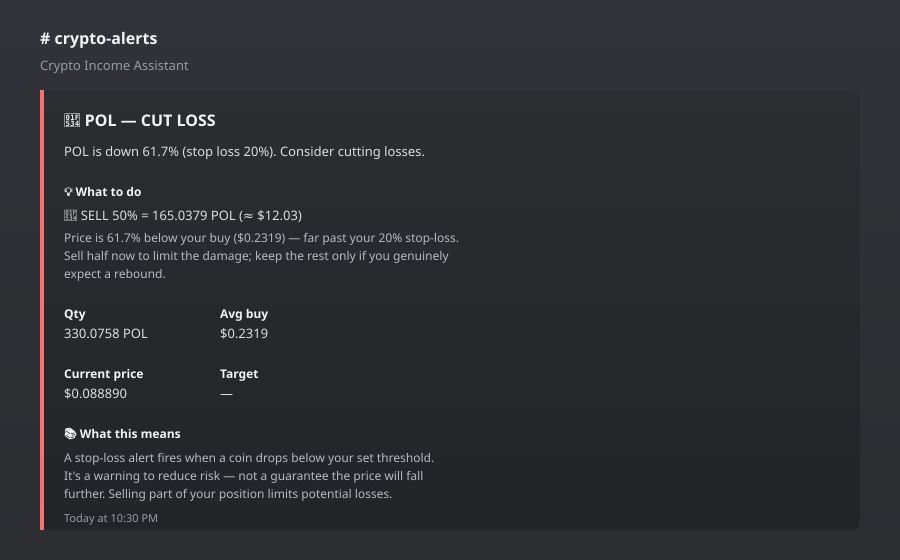

# Crypto Income Assistant

A local, self-hosted crypto portfolio tracker and 24/7 market scanner with Discord alerts. Tracks real Binance holdings, scans markets every 60 seconds, sends Discord alerts with rule-based advice, and exposes a React dashboard. Runs entirely on your machine for **$0/month**.

---

## Table of Contents

- [Prerequisites](#prerequisites)
- [Installation](#installation)
- [Application Startup](#application-startup)
- [IP Address & Ports](#ip-address--ports)
- [What It Does](#what-it-does)
- [Configuration](#configuration)
- [Documentation](#documentation)
- [Tech Stack](#tech-stack)
- [License](#license)

---

## Prerequisites

| Requirement | Version | Notes |
|---|---|---|
| Node.js | 24+ (tested on 24.13.1) | Includes npm |
| npm | 10+ | Bundled with Node.js |
| Binance account | Any | Uses public API — no API keys required |
| Discord webhook | Optional | Needed for Discord alerts |
| Google Drive | Optional | For cloud backups |

> **Note:** The app uses Binance's **public** REST API (prices, 24h stats, candlesticks). No API keys or secrets are needed. All data stays local in a SQLite database.

---

## Installation

### 1. Clone or copy the project

Place the project folder anywhere on your machine (e.g., `F:\GitHub\Nitrogen App`).

### 2. Install npm packages

From the project root, run:

```bash
npm install
```

This installs the root workspace dependencies **and** the frontend workspace (`src/web`) automatically via npm workspaces.

> **What gets installed:**
> - Root: `express`, `better-sqlite3`, `exceljs`, `concurrently`
> - Frontend (`src/web`): `react`, `react-dom`, `http-proxy-middleware`, `vite`, `@vitejs/plugin-react`

### 3. Configure the app

Copy the example config to a working config (if not already present):

```bash
# Windows (PowerShell)
Copy-Item src\appsettings.example.json src\appsettings.json

# macOS / Linux
cp src/appsettings.example.json src/appsettings.json
```

Then edit `src/appsettings.json`:

- **`alerts.discordWebhookUrl`** — paste your Discord webhook URL to enable alerts
- **`server.port`** / **`frontend.port`** — change ports if 10061/10065 are taken
- **`backup.googleDriveFolder`** — set your Google Drive backup folder path

### 4. (Optional) Enable HTTPS

Self-signed certs are expected at `src/certs/key.pem` and `src/certs/cert.pem`. If missing, HTTPS is skipped automatically and only HTTP is used. To generate certs:

```bash
# Windows (PowerShell)
openssl req -x509 -newkey rsa:2048 -nodes -keyout src\certs\key.pem -out src\certs\cert.pem -days 365 -subj "/CN=localhost"
```

---

## Application Startup

### Production start (recommended)

```bash
npm start
```

This command:
1. Builds the React frontend (`npm run build:web`)
2. Launches the watchdog (`scripts/start.mjs`)
3. Watchdog spawns **backend** (`src/index.js`) and **frontend** (`src/web/server.js`)
4. Auto-restarts either process if it crashes (3s delay if it ran 3s+, 10s if it crashed immediately)

### Development mode (hot reload)

```bash
npm run dev
```

Runs backend + frontend with live reload via `concurrently`.

### Manual build (frontend only)

```bash
npm run build:web
```

### Auto-start on boot (Windows)

The project includes an AutoHotkey v2 script (`start-nitrogen.ahk`) and an installer:

```bash
powershell -ExecutionPolicy Bypass -File scripts\install-autostart.ps1
```

This creates a shortcut in the Windows Startup folder so the app launches automatically when you log in.

---

## IP Address & Ports

The app binds to **localhost only** (`127.0.0.1`) for security — it is not exposed to your network or the internet.

| Service | HTTP | HTTPS | Purpose |
|---|---|---|---|
| Backend API | `http://127.0.0.1:10061` | `https://127.0.0.1:10062` | REST API + scanner + alerts |
| Frontend Dashboard | `http://127.0.0.1:10065` | `https://127.0.0.1:10066` | React web dashboard |

### Open the dashboard

In your browser, go to:

```
http://127.0.0.1:10065
```

### Key API endpoints

| Endpoint | Description |
|---|---|
| `http://127.0.0.1:10061/api/portfolio` | Portfolio rows + totals (live prices) |
| `http://127.0.0.1:10061/api/scanner` | Current scanner verdicts |
| `http://127.0.0.1:10061/api/analysis/XRP` | Detailed analysis for one coin |
| `http://127.0.0.1:10061/api/trades` | Trade history |
| `http://127.0.0.1:10061/api/events` | SSE stream (browser toasts) |

> **To access from another device on your LAN**, you'd need to change `host` to `0.0.0.0` in `appsettings.json` and open the firewall port. This is **not recommended** — the app has no authentication.

---

## What It Does

- **Tracks real Binance holdings** — imports trade history, calculates PnL, shows live prices
- **Scans markets every 60s** — RSI, volume spikes, momentum, breakouts
- **Sends Discord alerts** — with rule-based advice ("SELL 50%", "BUY $5-10", etc.)
- **Dashboard** — portfolio, scanner signals, trade log, settings
- **Sell simulator** — "What happens if I sell X%" with live formulas
- **Backup** — Google Drive copy, nightly schedule, restore on startup
- **Grid layout** — switch between tab view and all-panels dashboard on wide monitors

---

## Screenshots

### Dashboard

The main dashboard shows your portfolio summary cards, positions table, and coin cards with live prices, PnL, and break-even.



### Sell Simulator

The "What happens if I sell X%" calculator shows every result with its live formula using your real numbers.



### Discord Alert

Alerts sent to Discord include the signal, rule-based advice, your position details, and a plain-English explanation.



---

## Configuration

All settings live in `src/appsettings.json`. Key sections:

| Section | Purpose | Key Settings |
|---|---|---|
| `server` | Backend ports, HTTPS | `port: 10061`, `httpsPort: 10062` |
| `frontend` | Frontend ports, HTTPS | `port: 10065`, `httpsPort: 10066` |
| `database` | SQLite file | `path: data/crypto_portfolio.db` |
| `binance` | API base, poll interval | `baseUrl`, `pricePollSec: 60`, `candleInterval: 1h` |
| `scanner` | Scan interval, thresholds | `scanIntervalSec: 60`, `rsiOverbought: 70`, `rsiOversold: 30` |
| `alerts` | Discord, explanations | `discordWebhookUrl`, `includeExplanations: true`, `minMinutesBetweenAlerts: 30` |
| `consultant` | AI verdicts toggle | `aiInAlerts: false`, `plannerInAlerts: true` |
| `backup` | Google Drive, schedule | `googleDriveFolder`, `nightlyTime: 02:00`, `keepDays: 30` |
| `watchlist` | Default coins | `defaults: [XRP, POL, DOT, WLD, ADA, DOGE]` |

**Key settings to customize:**
- `alerts.discordWebhookUrl` — your Discord webhook URL (required for alerts)
- `scanner.scanIntervalSec` — how often to scan (default 60s)
- `consultant.aiInAlerts` — enable AI verdicts (requires opencode-cli)

---

## Documentation

Full documentation is in the `docs/` folder:

- **[Architecture and Other Details.md](docs/Architecture%20and%20Other%20Details.md)** — Complete system specification:
  - System architecture & tech stack
  - Database schema & data models (6 SQLite entities)
  - Full RESTful API endpoint reference (13 endpoints with request/response contracts)
  - Data flow diagrams & configuration reference

- **[Context Ledger.md](docs/Context%20Ledger.md)** — Engineering session ledger:
  - Current machine context & environment state
  - Session history (7 sessions)
  - Current status, known issues, next steps

---

## Tech Stack

| Layer | Technology |
|---|---|
| Backend | Node.js 24+ / Express 4 / ES modules |
| Database | SQLite via `better-sqlite3` v12 |
| Frontend | React 18 + Vite 6 |
| Proxy | `http-proxy-middleware` v3 |
| Backup | Local snapshots + Google Drive |
| Auto-start | AutoHotkey v2 + Windows Startup folder |

---

## License

Private — personal use only.
